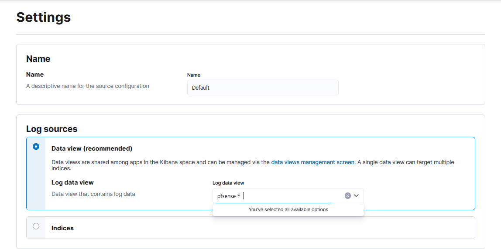

# ELK Demo

A hands-on lab showing how to ship pfSense firewall logs into an ELK
(Elasticsearch, Logstash, Kibana) stack, parse them, build
visualizations, and trigger alert emails via MailHog. Along the way,
you'll learn:\
\
- How to stand up a pfSense VM in VirtualBox\
- How syslog works end-to-end (pfSense → Logstash → Elasticsearch)\
- How to write and refine grok patterns to structure your logs\
- How to build Kibana Discover views, Lens charts, and index patterns\
- How to configure Kibana Alerting and test it with a dummy SMTP
(MailHog)

## Why this project?

I wanted a reproducible demo of a security-monitoring pipeline:\
1. pfSense for network perimeter logging\
2. ELK for storage, indexing, and visualization\
3. Kibana Alerts + MailHog for email-based notifications\
\
This covers the full signal chain from raw packets → alerts, and helps
me---or anyone else---learn each component in isolation and together.

## 1. pfSense in VirtualBox

### What we're doing

\- Importing the official pfSense OVA\
- Removing the installer ISO so it boots the configured disk\
- Verifying the console splash and LAN/WAN interfaces

### Why

\- VirtualBox lets us simulate a firewall appliance on our laptop\
- Getting the interfaces right ensures real-world packet flow

- Let's start by installing VirtualBox and setting up a pfSense instance

  - 

- Now we're installing the pfSense image

  - 

- Installation is complete, so we'll move on to configuring the WAN
  interface

  - 

  - 

<!-- -->

- Remove the ISO from the virtual drive

  - 

<!-- -->

- We've reached the initial setup screen, and everything looks good

  - 

- Let's try logging into the pfSense web UI

  - 

- The UI is loading properly

  - 

- Now let's verify LAN to WAN connectivity using a ping test

  - 

- Setting up LAN rules: the Anti-Lockout Rule allows access to the web
  UI over ports 443 and 80 on the LAN IP

  - 

## 2. ELK Stack (Docker Compose)

### What we're doing

\- Creating a project folder (elk-pfsense/)\
- Writing a docker-compose.yml with Elasticsearch, Logstash, Kibana,
MailHog\
- Starting everything with docker compose up -d

### Why

\- Docker Compose isolates each service for easy teardown/rebuild

- Create an ELK project folder, define the docker-compose.yml file, and
  set up the Logstash pipeline

- Start the ELK stack

  - 

- Verify that all containers are up and running

  - 

  - 

- Configure remote logging in pfSense to begin capturing logs

  - 

## 3. Logstash Pipeline

### What we're doing

\- Defining pipeline.conf to listen on UDP/514 for pfSense logs\
- Pointing to a custom grok-patterns.conf with a PFSENSESYSLOG pattern\
- Outputting into daily indices named pfsense-YYYY.MM.dd

### Why

\- Grok patterns turn free-form text into structured JSON fields\
- Daily indices make retention policies and roll-overs easy

- Tail the Logstash logs using: docker logs -f elk-logstash-1

  - 

- Update pfsense.conf with the appropriate Grok patterns

  - 

- Success, pfSense logs are now flowing through the Grok to CSV to date
  pipeline

  - 

## 4. Kibana Setup & Visualizations

### What we're doing

1\. Creating an index pattern: pfsense-\*\
2. Exploring Discover to verify parsed JSON fields\
3. Building a Lens chart (e.g. "Count of action=block over time")

### Why

\- Confirm that Logstash parsing worked end-to-end\
- Gain insights into blocked vs. allowed traffic trends

- Create a new data view in Kibana for the pfSense log index pattern

  - 

- Confirm it\'s working in Discover, parsed JSON events and charts look
  good

  - 

- Explore the Visualizations tab using the Lens chart type to view
  record counts over time

  - 

## 5. Alerting with MailHog

### What we're doing

\- Running MailHog on SMTP port 1025\
- In Kibana Stack Management → Alerting, creating:\
- An Email connector (SMTP → mailhog:1025)\
- A Log threshold alert on pfsense-\* index (count of action:block \> 10
in last 5 min)\
- Flooding logs with a quick PowerShell loop

### Why

\- Effective monitoring means alerts, not just dashboards\
- MailHog captures emails without spamming a real inbox

- Spin up MailHog to serve as the SMTP server

  - 

- Confirm that the MailHog UI is up and running

  - 

- Set up the email connector in Kibana

  - 

- Switch the log source to the pfSense data view

  - 

- Create a test alert for verification

  - 

- Successfully received the test email in MailHog

  - 

- Create a log threshold rule to monitor when we get a surge of blocked
  packets

  - 

- Configure the email action for alert notifications

  - 

- Use a PowerShell loop to flood LogStash with blocked syslog messages

  - 

- Success, the alert was triggered and the email was received!

  - 
